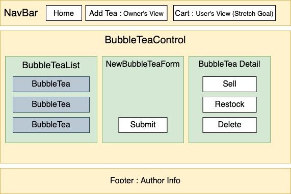

# Bubble Tea Order Management Site :tea:

#### A merchant site that allows user to manage the bubble tea order with full CRUD functionality 

#### By **Jieun Kang and Jiwon Han**

[](https://www.repostatus.org/#wip)


[](https://lbesson.mit-license.org/)


## 1. User Flow

This is a bubble tea order site with create/read/update/delete functionality. A desirable user would be a employeer or employees in bubble tea shop.

1. A user is able to create new bubble tea in the system.
2. A user is able to check each bubble tea's detail.
3. A user is able to update quantities as per order status.
4. A user is able to see if bubble tea is out of stock as message shown.
5. A user is able to restock bubble tea and the out of stock message disappear.
6. A user is able to delete a bubble tea item. 

### Sreenshot



## 2. Development
### Tech stack:
+ [NPM](https://www.npmjs.com/) for package management
+ [react](https://reactjs.org/) as core stack
+ [drawio](https://app.diagrams.net/) for diagram
+ [favicon](https://www.favicon-generator.org/) for a bubble tea favicon

### To run dev mode locally:
```bash
  $ git clone https://github.com/jiwon-seattle/Bubble-tea-order-management-site.git
  $ cd merchant-site
  $ npm install  
  $ npm install react-bootstrap bootstrap
  # After successfull pkg installtion
  $ npm start
```
Now, it will automatically open http://localhost:3000 and show you bubble tea order management site website.

## 3. Known Bugs

There are no known bug at this moment

## 4. Support and contact details

Any feedback is appreciated! Please contact at email: Jieun Kang jieunkang101@gmail.com or jiwon1.han@gmail.com

### License

*This software is licensed under the MIT license*

Copyright (c) 2020 **_Jieun Kang and Jiwon Han_**
